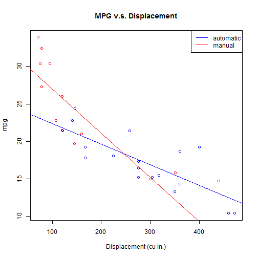

## My Shiny App: Milage Predictor

It helps you predict the milage of any car based on engine size, horse power, weight or 1/4 mile time.

You can find my useful Shiny data product at: https://andraspap.shinyapps.io/Assignment/

Give it a try!!

--- .class #id 

## Prediction Is Based on the "mtcars" Data Set
The first 15 of the 32 cars in the data set:

```
##                     mpg cyl  disp  hp drat    wt  qsec vs am gear carb
## Mazda RX4          21.0   6 160.0 110 3.90 2.620 16.46  0  1    4    4
## Mazda RX4 Wag      21.0   6 160.0 110 3.90 2.875 17.02  0  1    4    4
## Datsun 710         22.8   4 108.0  93 3.85 2.320 18.61  1  1    4    1
## Hornet 4 Drive     21.4   6 258.0 110 3.08 3.215 19.44  1  0    3    1
## Hornet Sportabout  18.7   8 360.0 175 3.15 3.440 17.02  0  0    3    2
## Valiant            18.1   6 225.0 105 2.76 3.460 20.22  1  0    3    1
## Duster 360         14.3   8 360.0 245 3.21 3.570 15.84  0  0    3    4
## Merc 240D          24.4   4 146.7  62 3.69 3.190 20.00  1  0    4    2
## Merc 230           22.8   4 140.8  95 3.92 3.150 22.90  1  0    4    2
## Merc 280           19.2   6 167.6 123 3.92 3.440 18.30  1  0    4    4
## Merc 280C          17.8   6 167.6 123 3.92 3.440 18.90  1  0    4    4
## Merc 450SE         16.4   8 275.8 180 3.07 4.070 17.40  0  0    3    3
## Merc 450SL         17.3   8 275.8 180 3.07 3.730 17.60  0  0    3    3
## Merc 450SLC        15.2   8 275.8 180 3.07 3.780 18.00  0  0    3    3
## Cadillac Fleetwood 10.4   8 472.0 205 2.93 5.250 17.98  0  0    3    4
```

--- .class #id 

## Clear Graphs Show the Result

 

--- .class #id 

## Thank You


Thank You for listening to me!

Check out my app: https://andraspap.shinyapps.io/Assignment/

Download it from: https://github.com/andraspap/DevelopingDataProducts_ShinyApp


